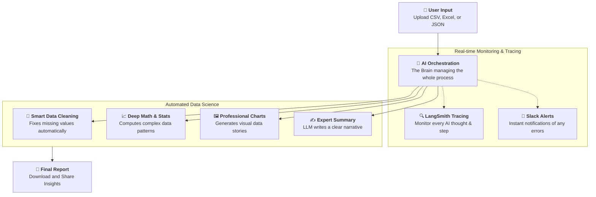

# 🔬 Autonomous Data Analysis Agent

A streamlined AI-powered data scientist that transforms raw data into professional insights. Built with **LangGraph**, **Groq LLM**, and **Streamlit**.

---

## 🚀 How it Works

A simple look at how your data is transformed into insights:



### The Journey of Your Data
1. **User Input**: You simply upload your file and tell the agent how to handle any missing pieces.
2. **Orchestration**: The AI "Brain" takes over, planning every step of the analysis.
3. **Deep Analytics**: Multiple tools work together to clean, calculate, and visualize your data.
4. **Final Result**: You get a professional summary and a downloadable interactive report ready for your team.

### Core Components
- **Orchestration**: `LangGraph` handles the state machine and flow logic.
- **LLM**: `Groq` (Llama 3.3 70B) for plan generation and narrative synthesis.
- **Processing**: `Pandas` for robust data manipulation.
- **Visualization**: `Matplotlib` and `Seaborn` for high-quality data charts.
- **Interface**: `Streamlit` for a premium, reactive user experience.

---

## 📂 Project Structure

```
DATASCIENCE-AGENT/
├── main.py           # Streamlit UI & Entry Point
├── graph/            # LangGraph Workflow & Nodes
├── tools/            # Data Processing & Viz Tools
├── exceptions/       # Specialized Error Handling
├── utils/            # Session & State Management
├── tmp/              # Transient Storage (Charts & Reports)
└── requirements.txt  # Project Dependencies
```

---

## 🛠️ Quick Start

### 1. Installation
```bash
pip install -r requirements.txt
```

### 2. Configuration
Create a `.env` file with your credentials:
```env
GROQ_API_KEY=your_gsk_...
LANGCHAIN_API_KEY=your_ls_... (Optional for tracing)
SLACK_WEBHOOK_URL=https://... (Optional for alerts)
```

### 3. Launch
```bash
streamlit run main.py
```

---

## ✨ Key Features
- **Smart Cleaning**: Auto-detection of missing values with user-selectable strategies.
- **Interactive Reports**: Generates self-contained HTML reports with embedded charts.
- **Self-Correction**: Pipeline automatically retries failed steps with error logging.
- **Instant Export**: Download full reports or share summaries to Slack instantly.
- **Fast & Efficient**: No duplicate file creation; uses original paths and optimized memory.

---

## 📊 Supported Formats
Supports **CSV**, **Excel (.xlsx/.xls)**, **JSON**, and **Parquet**.